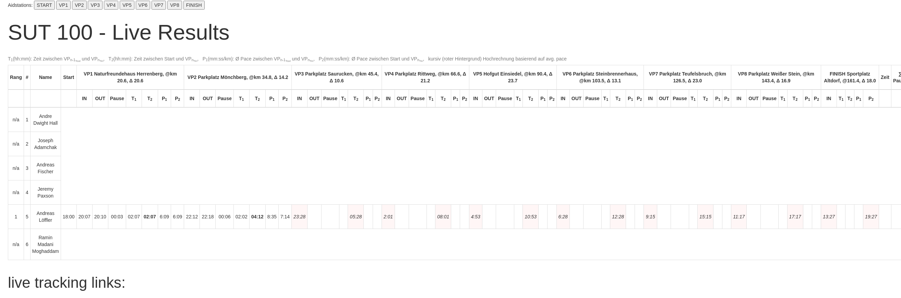

# ultraresult


[](https://github.com/lefty01/ultraresult/actions/workflows/node.js.yml)


[](https://github.com/lefty01/ultraresult/actions/workflows/codeql-analysis.yml)

<!-- 
[](https://travis-ci.org/lefty01/ultraresult)
-->

[](https://gitter.im/lefty01/ultraresult?utm_source=badge&utm_medium=badge&utm_campaign=pr-badge&utm_content=badge)

Track times when runners enter and leave an aidstation/checkpoint during a (ultra) run/race.
This nodejs/express/mongodb based app offers webpages for each aidstation showing the runner list and two input fields for the in and out time.
It will also feature a "DNF" page where a runner can be marked if he drops out of the run. The DNF page has in addition the option to reset the currently stored results for that runner. As it is right now only a user named 'admin' will be able to open that DNF page. The "Aid" pages can only be viewed by registered users. Note: a user is someone who can edit the runners times via the "Aid" pages. There is a mongodb collection for users as well as for runners. The runners list aka starters or the startlist can be managed via the [sutrunner](https://github.com/lefty01/sutrunner) tool.

Furthermore a overall result webpage with the current overall standings (live result) is offered. This page is currently the main entry page. On that result page you will find the links to the aidstation pages, including "Start" and "Finish" pages at the top. If not logged in you will get to the login page before being able to save/edit times.
This result page will show the entered times for each of the runners. Additionaly based on the current overall average pace  the times to the next aidstation/checkpoint and finish line is shown. This estimates will change over time once additional times are entered and the avg. pace most likely will vary here.

### results webpage

Shows results aka aidstation in/out times as they are entered.
In addition time spent at each aid station is calculated and displayed. Also total pause time is shown.
And following times and pace info is shown as well:

* T1: hh:mm time between this aid in and last aid out
* T2: hh:mm time between this aid in and start (aka current total time)
* P1: avg pace for last segment (min:ss per km between this aid in and last out)
* P2: total avg pace from start until this aid in
  T1(hh:mm): Zeit zwischen VPn-1Tout und VPnTin ,   T2(hh:mm): Zeit zwischen Start und VPnTin ,   P1(mm:ss/km): Ø Pace zwischen VPn-1Tout und VPnTin ,   P2(mm:ss/km): Ø Pace zwischen Start und VPnTin

Result table is sorted by total time (runners having more aid station out times are higher ranked of course, even though total time would be higher).
The related javascript is in results.js

This is how the results page should look like:


As a logged in user (or runner) you can also click the "Add tracking link" link and then enter a uniq name and url that will be displayed here. For example if you use garmin live track feature you could grab that url and make it public here. Currently it needs to be removed manually from the database.

### aid pages (aidstation input)

The buttons at the top link to the "Aid" pages, you can reach them at `/aid/2`, `/aid/vp2`, or `/aid/start` for example.

Below image shows the "Start" Aid-Page. This page only allows to save the "OUT" time (by contrast the "FINISH" page only offers "IN" times to be saved).


At the time you open or reload a "Aid" page it should display current date/time in the appropriate fields. So usually one could just open the page and click the "SAVE" button to store this time into the database. The background color of a saved data/time field will be a light red color to inidicate the time is saved in the database and the fields a "locked" so you cannot change the time. If you want to edit the time click the "EDIT" button, the background color changes to green and the fields become editable again. If you edit a field click "SAVE" again (locks field, turns red again).

The related javascript code is in aidstation.js

Here is an example of an aidstation 


Finally here is one more screenshot of the results page after a the start of the run and after VP2 was left:



As you can see the first leg (Start to VP1) was run at a avg. pace P1 of 6:09 /km  that is equal to total avg. pace. After reaching VP2 runner slowed done and avg. pace P1 for that second leg (VP1-VP2) was 8:35 that leads to an overall avg. pace P2 at that point of 7:14.  This last avg. pace is then used to calculate the values shown with a red background. Those are the aidstation IN times and the total time if we could continue at such pace.


## Config

Now featuring a config file which currently holds various config options (like mongo database name, host and port)
Format is json, for example create a file called 'ultraresult.conf':

```json
{
    "database": {
        "name" : "",
	    "host" : "",
	    "port" : ,
	    "username" : "",
	    "password" : "",
	    "sslcafile": "",
	    "sslkeyfile": "",
	    "authdb": ""
    }
}
```


### aidstation json file

Such a file can be generated or created manually and then imported into the mongodb collection named "aidstations"

`> db.aidstations.find({})`

```db.aidstations.find({})
{ "_id" : ObjectId("6165a12e3a18332785ae8337"), "lat" : 48.61589, "lng" : 8.99734, "legDistance" : 0, "totalDistance" : 0, "height" : 520.66, "pointType" : "Start", "name" : "START", "directions" : "Sportplatz Altdorf" }
{ "_id" : ObjectId("6165a12e3a18332785ae833b"), "lat" : 48.551914, "lng" : 9.056759, "legDistance" : 21.2, "totalDistance" : 66.6, "height" : 473.8, "pointType" : "Food", "name" : "VP4", "directions" : "Parkplatz Rittweg" }
{ "_id" : ObjectId("6165a12e3a18332785ae833f"), "lat" : 48.60278, "lng" : 8.903399, "legDistance" : 20.6, "totalDistance" : 20.6, "height" : 548.7, "pointType" : "Food", "name" : "VP1", "directions" : "Naturfreundehaus Herrenberg" }
{ "_id" : ObjectId("6165a12e3a18332785ae833d"), "lat" : 48.586279, "lng" : 8.920947, "legDistance" : 14.2, "totalDistance" : 34.8, "height" : 517.3, "pointType" : "Food", "name" : "VP2", "directions" : "Parkplatz Mönchberg" }
{ "_id" : ObjectId("6165a12e3a18332785ae8340"), "lat" : 48.556639, "lng" : 9.135306, "legDistance" : 23.74, "totalDistance" : 90.4, "height" : 429.6, "pointType" : "Food", "name" : "VP5", "directions" : "Hofgut Einsiedel" }
{ "_id" : ObjectId("6165a12e3a18332785ae833c"), "lat" : 48.5928, "lng" : 9.14731, "legDistance" : 13.1, "totalDistance" : 103.5, "height" : 477.5, "pointType" : "Food", "name" : "VP6", "directions" : "Parkplatz Steinbrennerhaus" }
{ "_id" : ObjectId("6165a12e3a18332785ae833a"), "lat" : 48.6207, "lng" : 9.11771, "legDistance" : 23, "totalDistance" : 126.5, "height" : 469.3, "pointType" : "Food", "name" : "VP7", "directions" : "Parkplatz Teufelsbruch" }
{ "_id" : ObjectId("6165a12e3a18332785ae833e"), "lat" : 48.56072, "lng" : 8.983784, "legDistance" : 10.6, "totalDistance" : 45.4, "height" : 473.6, "pointType" : "Food", "name" : "VP3", "directions" : "Parkplatz Saurucken" }
{ "_id" : ObjectId("6165a12e3a18332785ae8338"), "lat" : 48.603193, "lng" : 9.054564, "legDistance" : 16.9, "totalDistance" : 143.4, "height" : 503.1, "pointType" : "Food", "name" : "VP8", "directions" : "Parkplatz Weißer Stein" }
{ "_id" : ObjectId("6165a12e3a18332785ae8339"), "lat" : 48.61571, "lng" : 8.99734, "legDistance" : 18, "totalDistance" : 161.4, "height" : 523.29, "pointType" : "Finish", "name" : "FINISH", "directions" : "Sportplatz Altdorf" }
```

Important here is pointType (one of Start, Finish, or Food) and name needs to match either VP[digit] or START, FINISH.


### generate password hash

You can use these commands to generate a password hash that can be stored into the users collection of the database.

#### htpasswd

> $ htpasswd -bnBC 10 "" password | tr -d ':' | sed 's/$2y/$2a/

#### node.js

> var bcrypt = require('bcryptjs');
> var salt = bcrypt.genSaltSync(10);
> var hash = bcrypt.hashSync(process.argv[2], salt);
> console.log(hash);


```
$ npm i --package-lock-only
```


## database setup / layout

### mongoimport
on redhat 8.4 required this env setting (with ssl)

```
$ export GODEBUG="x509ignoreCN=0"
```

then import:

```
$ mongoimport -v --ssl --sslCAFile CA.pem --sslPEMKeyFile client.pem  -u user -p passw0rd --authenticationDatabase database --host localhost --port port -d database -c collection --drop --file coll_file.json
2021-10-08T16:08:03.541+0200	using write concern: &{majority false 0}
2021-10-08T16:08:03.542+0200	using 8 decoding workers
2021-10-08T16:08:03.542+0200	using 1 insert workers
2021-10-08T16:08:03.542+0200	will listen for SIGTERM, SIGINT, and SIGKILL
2021-10-08T16:08:03.925+0200	filesize: 2066 bytes
2021-10-08T16:08:03.925+0200	using fields:
2021-10-08T16:08:03.925+0200	connected to: mongodb://localhost:3333/
2021-10-08T16:08:03.925+0200	ns: database.collection
2021-10-08T16:08:03.953+0200	connected to node type: standalone
2021-10-08T16:08:03.953+0200	dropping: database.collection
2021-10-08T16:08:04.025+0200	9 document(s) imported successfully. 1 document(s) failed to import.
```


## Implementation details

read the source


## TODOs
* write test
* language (don't mix german english, switch language button)
* socket io update result table on aidstation input (real-time-feeling)
* Race prediction can take course elevation into account if that data is provided.
* dnf button - note: button is there but nothing happens ...
* sort ?? what did this mean
* tracking links: better looks, add date/time whe it was created
* merge certificate branch, people can print finisher certificate based on some pdf template


## Misc

### update package-lock version

```
$ npm i --package-lock-only
```


### mongo db cmdline snippets

remove all documents from collection:
> db.aidstations.remove({})

remove/drop collection:
> db.aidstations.drop()


reset results for runner by startnum (eg. startnum=1, nModified=1 if updated or 0 if no results field present):
> db.runnerlist.find()
> db.runnerlist.update({'startnum': 1}, {$unset: { results:1 }}, false, true);


update document within collection:
this would replace the document mathcing name and direction string, but the updated document only has new name and new directions. ALL OTHER FIELDS ARE GONE!
> db.aidstations.update( {name" : "Finish", directions : "Finish" }, { name : "FINISH", directions: "Sportplatz Altdorf" })
here we include all fields and change the ones we need
> db.aidstations.update( {"name" : "FINISH" }, { "lat" : "48.61571", "lng" : "8.99734", "legDistance" : "26.482", "totalDistance" : "163.283", "height" : "523.29", "pointType" : "Finish", "name" : "Finish", "directions" : "Sportplatz Altdorf" } )

Using updateOne and only specify fields to change via $set
> db.aidstations.update( {"name" : "Finish" }, { $set: { "name" : "FINISH" } } )


Remove the field (eg. the aidstations array field)  from a document with $unset:
> db.runnerlist.update( {"startnum" : "1" }, { $unset : { "aidstations" : "" } }  )

push an element onto the aidstations array: NOTE: always adds new element
here this only makes sense if there's no such array item available 
> db.runnerlist.update( {"startnum" : "1" }, { $push : { "aidstations" : { name : "VP1", "intime" : "16:00", "intime_valid" : true } } } )


find runner by startnum and aidstation name:
> db.runnerlist.find( {"startnum" : "1", "aidstations.name" : "VP2" }  )
> db.runnerlist.find( {"startnum" : "1", "aidstations.name" : "START" }  )

-> if nothing returned, then can push ...

update/add aidstation times for runner, need to modify an existing element from the aidstation array
eg. aidstations.name : VP1


different approach, without array 
> db.runnerlist.update( {"startnum" : "1" }, { $set : { "results.START.intime_valid" : "false", "results.START.outtime_valid" : "true", "results.START.outtime":"16:30"} } )

